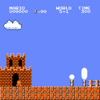
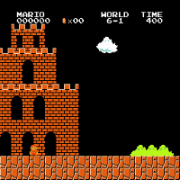
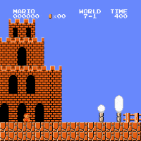
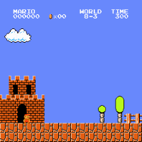

# Reinforcement learning plays Super Mario Bros (NES)

# Introduction

I took the environment, idea and inspiration from [this repo](https://github.com/uvipen/Super-mario-bros-PPO-pytorch).

Using [my code for training PPO](https://github.com/CherryPieSexy/imitation_learning) I was able to solve 27/32 levels.
I believe 4 out of 5 these levels are still possible to solve, just need to train or tune longer.

Unsolved levels:
 - 4-4 - a labyrinth, for some reason environment restrictions are not good enough to prevent agent from running into loops.
 - 5-3 and 6-3 - difficult platforming.
 - 8-1 - long level, there are 2 hard segments near the end of the level agent struggle to solve.
 - 8-4 - very hard labyrinth.   

(TODO): cut success from 7-2

<p align="left">
    
    
    
    <br/>
    
    
    
    <br/>
    
    
    
    <br/>
    
    
    <br/>
    
    
    <br/>
    
    
    <br/>
    
    
    
    <br/>
    
    <br/>
    <i>Sample results</i>
</p>

## Instructions

It is possible to train a new model and watch how it plays the game with this code.

### Training
The most important training parameters are learning rate and entropy. They are both accessible via args.
For training new model, run the command
```
python src/train.py -w {world} -l {level}
```

### Testing
Checkpoints of trained models are located at the [google drive](https://drive.google.com/drive/folders/1T3H6nRn9LG0LGdI-kWNW8iCpytF6GBJg?usp=sharing).
For testing the checkpoint, place it in [checkpoints](checkpoints) folder and run the command:
```
python src/test.py -w {world} -l {level} -r
```

### Further plans
It is interesting to re-produce results of the ICM paper
[site](https://pathak22.github.io/noreward-rl/), [paper 2](https://arxiv.org/abs/1808.04355)
where an RL agent learns how to explore the environment without reward and solves 11 levels.
